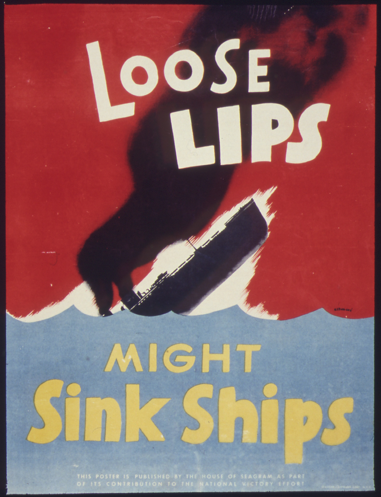

# looselips



Scan your LLM chat exports for personal information you might not want sitting in the cloud.

## Install

```bash
pip install looselips
```

## Basic usage

1. Export your data from ChatGPT (Settings -> Data controls -> Export).
2. Create a `looselips.toml` config defining what to look for (see below).
3. Run:

```bash
looselips chatgpt-export.zip --config looselips.toml
```

Writes `chatgpt-export_report.html` with any matches found.

## Config file

Define your matchers in a `looselips.toml`. See `examples/example.toml` for a
full example with common patterns.

```toml
[[matcher]]
type = "regex"
category = "My Phone"
pattern = '212.?867.?5309'

[[matcher]]
type = "regex"
category = "Home Address"
pattern = '(?i)742\s+Evergreen\s+Terrace'
```

Patterns use the Python [re](https://docs.python.org/3/library/re.html) module.
Inline flags like `(?i)` for case-insensitive, `(?s)` for dotall, and `(?x)` for
verbose mode (comments and ignored whitespace) work in the pattern string itself.

```bash
looselips chatgpt-export.zip --config looselips.toml
```

## LLM matchers

For things regex can't catch, add LLM matchers to your config.
Each one runs a separate inference pass per conversation chunk, so prefer
a few focused matchers over many broad ones.

```toml
model = "ollama/qwen3:0.6b"

[[matcher]]
type = "llm"
name = "Employment & Financial"
prompt = "Find employment and financial information -- company names, job titles, salary figures, stock grants."

[[matcher]]
type = "llm"
name = "Medical & Health"
prompt = "Find medical and health information -- conditions, medications, doctor names."
```

You can override the model per-matcher with the `model` key.

## Output

Default output is `<input>_report.html`. Override with `-o`:

```bash
looselips chatgpt-export.zip --config looselips.toml --output my_report.html
```

Everything runs locally -- no data leaves your machine (unless you use a cloud LLM model).

